<!--
  ───────────────────────────────────────────────────────────
  If you're reading the raw source, you're exactly the kind of
  person I'd want to build with. Say hi — prithvisarans@gwu.edu
  ───────────────────────────────────────────────────────────
-->

<!-- Hero Banner (Responsive Dark/Light mode) -->
<picture>
  <source media="(prefers-color-scheme: dark)" srcset="assets/hero-dark.svg">
  <source media="(prefers-color-scheme: light)" srcset="assets/hero-light.svg">
  
</picture>

<!-- Quick Navigation Links -->

  <a href="https://prithvidevelops.vercel.app"><b>Portfolio &nbsp;↗</b></a> &nbsp;&nbsp;·&nbsp;&nbsp;
  <a href="https://www.linkedin.com/in/prithvisaransathyasaran/"><b>LinkedIn &nbsp;↗</b></a> &nbsp;&nbsp;·&nbsp;&nbsp;
  <a href="https://leetcode.com/u/prithvisaran3/"><b>LeetCode &nbsp;↗</b></a> &nbsp;&nbsp;·&nbsp;&nbsp;
  <a href="mailto:prithvisarans@gwu.edu"><b>Email &nbsp;↗</b></a>

<!-- Live Metrics Dashboard -->
<picture>
  <source media="(prefers-color-scheme: dark)" srcset="assets/metrics-dark.svg">
  <source media="(prefers-color-scheme: light)" srcset="assets/metrics-light.svg">
  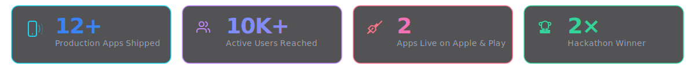
</picture>

<picture>
  <source media="(prefers-color-scheme: dark)" srcset="assets/divider.svg">
  <source media="(prefers-color-scheme: light)" srcset="assets/divider.svg">
  
</picture>

<!-- About Section Header -->
<picture>
  <source media="(prefers-color-scheme: dark)" srcset="assets/hdr-about.svg">
  <source media="(prefers-color-scheme: light)" srcset="assets/hdr-about.svg">
  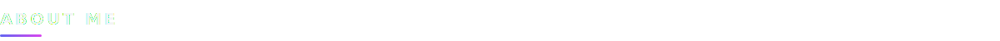
</picture>

I build mobile and AI products end to end — from the first Figma wireframe to the App Store review queue. Most engineers stop at "it works." I care about the last ten percent: the animation curve that feels physical, the cold-start latency nobody profiles, the empty state everyone forgets. Twelve-plus production apps, two of them live on the stores, and a run of award-winning AI builds later, that instinct is the throughline.

Right now, I'm finishing my M.S. in Computer Science at **The George Washington University** in Washington, DC, and looking for a full-time team that ships with taste.

<picture>
  <source media="(prefers-color-scheme: dark)" srcset="assets/divider.svg">
  <source media="(prefers-color-scheme: light)" srcset="assets/divider.svg">
  
</picture>

<!-- Tech Arsenal Header -->
<picture>
  <source media="(prefers-color-scheme: dark)" srcset="assets/hdr-stack.svg">
  <source media="(prefers-color-scheme: light)" srcset="assets/hdr-stack.svg">
  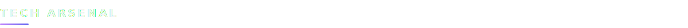
</picture>

<picture>
  <source media="(prefers-color-scheme: dark)" srcset="assets/stack-dark.svg">
  <source media="(prefers-color-scheme: light)" srcset="assets/stack-light.svg">
  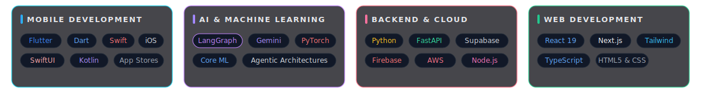
</picture>

<picture>
  <source media="(prefers-color-scheme: dark)" srcset="assets/divider.svg">
  <source media="(prefers-color-scheme: light)" srcset="assets/divider.svg">
  
</picture>

<!-- Featured Work Header -->
<picture>
  <source media="(prefers-color-scheme: dark)" srcset="assets/hdr-work.svg">
  <source media="(prefers-color-scheme: light)" srcset="assets/hdr-work.svg">
  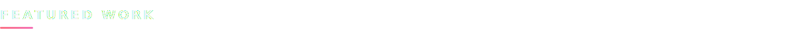
</picture>

<!-- Interactive Project Cards Showcase -->

<!-- Prommuni -->
<a href="https://apps.apple.com/us/app/prommuni/id6747644654">
  <picture>
    <source media="(prefers-color-scheme: dark)" srcset="assets/card-prommuni.svg">
    <source media="(prefers-color-scheme: light)" srcset="assets/card-prommuni.svg">
    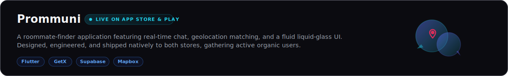
  </picture>
</a>

 

<!-- Drillhub -->
<a href="https://apps.apple.com/us/app/drillhub/id6754586332">
  <picture>
    <source media="(prefers-color-scheme: dark)" srcset="assets/card-drillhub.svg">
    <source media="(prefers-color-scheme: light)" srcset="assets/card-drillhub.svg">
    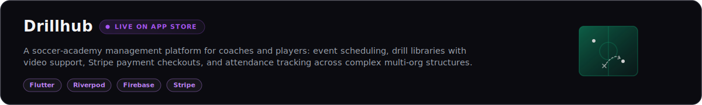
  </picture>
</a>

 

<!-- Blueprint AI -->
<a href="https://blueprint-ai-rust.vercel.app">
  <picture>
    <source media="(prefers-color-scheme: dark)" srcset="assets/card-blueprint.svg">
    <source media="(prefers-color-scheme: light)" srcset="assets/card-blueprint.svg">
    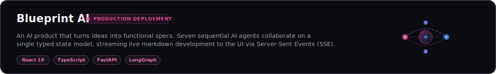
  </picture>
</a>

 

<!-- SNAPback -->
<a href="https://devpost.com/software/snapback-2s1lb7">
  <picture>
    <source media="(prefers-color-scheme: dark)" srcset="assets/card-snapback.svg">
    <source media="(prefers-color-scheme: light)" srcset="assets/card-snapback.svg">
    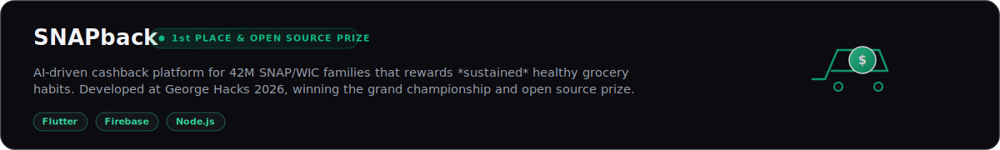
  </picture>
</a>

 

<!-- BarterBrAIn -->
<a href="https://prithvidevelops.vercel.app/projects">
  <picture>
    <source media="(prefers-color-scheme: dark)" srcset="assets/card-barterbrain.svg">
    <source media="(prefers-color-scheme: light)" srcset="assets/card-barterbrain.svg">
    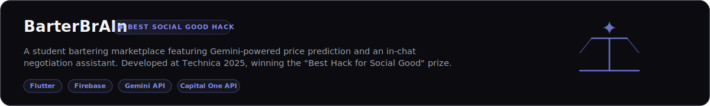
  </picture>
</a>

 

More on the [projects page ↗](https://prithvidevelops.vercel.app/projects) — PitchPulse (Hacklytics 2026), AuraTranslate, and 12 others.

<picture>
  <source media="(prefers-color-scheme: dark)" srcset="assets/divider.svg">
  <source media="(prefers-color-scheme: light)" srcset="assets/divider.svg">
  
</picture>

<!-- Experience Header -->
<picture>
  <source media="(prefers-color-scheme: dark)" srcset="assets/hdr-exp.svg">
  <source media="(prefers-color-scheme: light)" srcset="assets/hdr-exp.svg">
  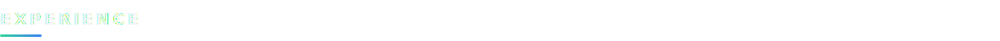
</picture>

≈ 2 years shipping mobile across four engineering teams.

<table>
<tr><td>
<b>Cloud Jovy</b> &nbsp;—&nbsp; Software Engineer Intern &nbsp;·&nbsp; San Diego, CA 
Built and shipped Flutter features for cross-platform products.
</td></tr>
<tr><td>
<b>Prommuni</b> &nbsp;—&nbsp; Mobile Engineer Intern &nbsp;·&nbsp; Maryland 
Took the Prommuni app from build to launch on the App Store and Google Play.
</td></tr>
<tr><td>
<b>LIMIT LESS 360</b> &nbsp;—&nbsp; Mobile App Developer 
Cross-platform Flutter apps published under the studio.
</td></tr>
<tr><td>
<b>TechCiti</b> &nbsp;—&nbsp; Mobile App Developer 
Client Flutter, Android, and iOS work.
</td></tr>
</table>

<picture>
  <source media="(prefers-color-scheme: dark)" srcset="assets/divider.svg">
  <source media="(prefers-color-scheme: light)" srcset="assets/divider.svg">
  
</picture>

<!-- Current Focus Header -->
<picture>
  <source media="(prefers-color-scheme: dark)" srcset="assets/hdr-focus.svg">
  <source media="(prefers-color-scheme: light)" srcset="assets/hdr-focus.svg">
  
</picture>

- Shipping **AuraTranslate** — on-device, real-time image translation with Core ML and Vision.
- Going deeper on **agentic AI** — multi-agent orchestration and typed state with LangGraph.
- Open to full-time roles: **Software · Mobile · ML · Cloud** engineering.

<picture>
  <source media="(prefers-color-scheme: dark)" srcset="assets/divider.svg">
  <source media="(prefers-color-scheme: light)" srcset="assets/divider.svg">
  
</picture>

<!-- Philosophy Header -->
<picture>
  <source media="(prefers-color-scheme: dark)" srcset="assets/hdr-philosophy.svg">
  <source media="(prefers-color-scheme: light)" srcset="assets/hdr-philosophy.svg">
  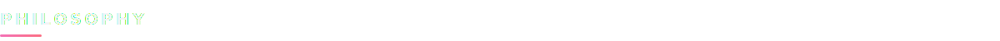
</picture>

> *Ship it, then earn the polish.*
>
> *The gap between a demo and a product is the boring ten percent — the error states, the offline path, the sixty-frames-per-second scroll. I'd rather ship one thing that feels inevitable than five that feel like prototypes.*

<picture>
  <source media="(prefers-color-scheme: dark)" srcset="assets/divider.svg">
  <source media="(prefers-color-scheme: light)" srcset="assets/divider.svg">
  
</picture>

<b>🔍 A few things that don't fit on a résumé</b>

 

- I name side projects before I build them — *Pouncio* (a real-time job-alert app) got its name from "pounce" months before the first commit.
- I trade FIFA Ultimate Team. It's low-key market-making: read the demand curve, price the spread, exit before the crowd. Same muscle as shipping.
- My favorite part of any build is the empty state. If you sweat the screen with nothing on it, you sweat everything.

Designed and written with hand-crafted aesthetics. Last shipped 2026.

